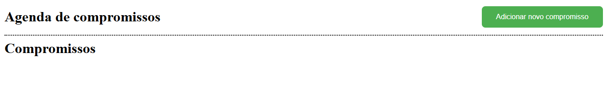

# 📅 Angular Project - Agenda de compromissos 📅

## 📌 Sobre o projeto
### Esse repositório Java é o Front-End do projeto da agenda de compromissos.

> 🎓 Projeto proposto na faculdade Fatec Itu/SP.

> 👨‍🏫 Projeto proposto pelo professor: Glauco Toledo.

## Commit feito para criação do Header.
> Commit do dia 02/12/2024 - 16:30

### Criado o Header e adicionado ao arquivo html principal para ficar como um componente "fixo".
### Site com o header na sua primeira versão:

#

## ❤️ Créditos:
- ### Créditos dos emojis:
> https://emojipedia.org

- ### Créditos ao professor que propos o projeto:
> https://github.com/glaucotodesco