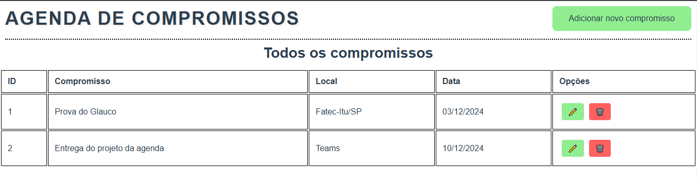
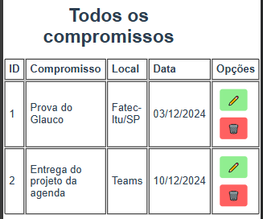

# 📅 Angular Project - Agenda de compromissos 📅

## 📌 Sobre o projeto
### Esse repositório Angular é o Front-End do projeto da agenda de compromissos.

> 🎓 Projeto proposto na faculdade Fatec Itu/SP.

> 👨‍🏫 Projeto proposto pelo professor: Glauco Toledo.

## Commit feito para adicionar os botões de edição e de deletar nas opções.
> Commit do dia 03/12/2024 - 15:56

### Criado os compononentes dos dois botões e adicionado nas tabelas
### Como ficou o site com as cameras adicionadas:
- #### No pc:

- #### No mobile:

#

## ❤️ Créditos:
- ### Créditos dos emojis:
> https://emojipedia.org

- ### Créditos ao professor que propos o projeto:
> https://github.com/glaucotodesco