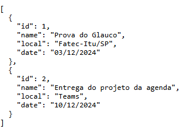

# 📅 Angular Project - Agenda de compromissos 📅

## 📌 Sobre o projeto
### Esse repositório Angular é o Front-End do projeto da agenda de compromissos.

> 🎓 Projeto proposto na faculdade Fatec Itu/SP.

> 👨‍🏫 Projeto proposto pelo professor: Glauco Toledo.

## Commit feito para criar o serviço para fazer o metodo GET no banco de dados
> Commit do dia 04/12/2024 - 16:01

### Criado o serviço para fazer a requisição GET e também feito pequenas alterações no código para conseguir realizar essa requisição.
### Como está vindo as respostas do Back-End Java:

#

## ❤️ Créditos:
- ### Créditos dos emojis:
> https://emojipedia.org

- ### Créditos ao professor que propos o projeto:
> https://github.com/glaucotodesco